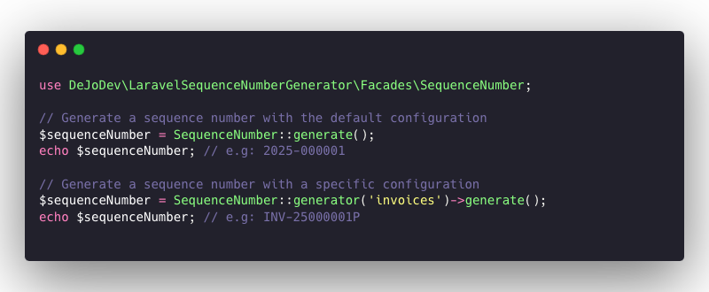

# Generate complex sequence numbers using DB locking to ensure each number is unique.
This package allows you to generate complex sequence numbers in Laravel applications. 
It uses database locking to ensure that each generated number is unique, even in high-concurrency environments. 
You can configure different sequence types, masks, and yearly resets to suit your application's needs.



## Features

- Generate unique sequence numbers using database locking
- Support for custom sequence types
- Configurable sequence masks
- Yearly resets for sequences
- High-concurrency environment support
- Easy configuration via environment variables
- Simple integration with Laravel applications

## Basic Usage

To generate a sequence number, you can use the facade provided by the package:

```php
use DeJoDev\LaravelSequenceNumberGenerator\Facades\SequenceNumber;

// Generate a sequence number with the default configuration
$sequenceNumber = SequenceNumber::generate();
echo $sequenceNumber; // e.g: INV-2025-000001 

// Generate a sequence number with a specific configuration
$sequenceNumber = SequenceNumber::generate('custom');
echo $sequenceNumber; // e.g: MY-TYPE-25-000001P
```

> **Warning** This package uses database locking to ensure that each generated number is unique so you must use a database that
supports lockForUpdate() like mysql, mariadb or postgresql.

## Installation

You can install the package via composer:
```bash
composer require dejodev/laravel-sequence-number-generator
```

Then publish and run the migrations with:
```bash
php artisan vendor:publish --tag="laravel-sequence-number-generator-migrations"
php artisan migrate
```

Set the environment variables in your `.env` file:

```dotenv
SEQUENCE_NUMBER_GENERATOR_DEFAULT=custom
SEQUENCE_NUMBER_GENERATOR_TYPE=default
SEQUENCE_NUMBER_GENERATOR_MASK={#}
SEQUENCE_NUMBER_GENERATOR_IS_YEARLY=false
```

### Environment Variables

- `SEQUENCE_NUMBER_GENERATOR_DEFAULT`: The default sequence configuration to use. default is `custom`.
- `SEQUENCE_NUMBER_GENERATOR_TYPE`: A string value that distinguishes between different sequence generators. default is `default`.
- `SEQUENCE_NUMBER_GENERATOR_MASK`: The mask format string for the sequence number. default is `{#}`.
- `SEQUENCE_NUMBER_GENERATOR_IS_YEARLY`: Boolean to determine if the sequence should reset yearly. default is `false`.

For advanced configuration you can publish the config file with:
```bash
php artisan vendor:publish --tag="laravel-sequence-number-generator-config"
```

This is the contents of the published config file:

```php
return [
    'default_generator' => env('SEQUENCE_NUMBER_GENERATOR_DEFAULT', 'default'),
    'default' => [
        'sequence_type' => env('SEQUENCE_NUMBER_GENERATOR_TYPE', 'default'),
        'mask' => env('SEQUENCE_NUMBER_GENERATOR_MASK', '{#}'),
        'is_yearly' => env('SEQUENCE_NUMBER_GENERATOR_IS_YEARLY', false),
    ],
    
    'simple' => [
        'sequence_type' => 'simple',
        'mask' => '{#}',
        'is_yearly' => false,
    ],
    
    'yearly' => [
        'sequence_type' => 'yearly',
        'mask' => '{y}-{######}',
        'is_yearly' => true,
    ],
];
```

Using the config file, you can define multiple sequence configurations for your application.
```php
return [
    'default_generator' => env('SEQUENCE_NUMBER_GENERATOR_DEFAULT', 'default'),

    'default' => [
        'sequence_type' => env('SEQUENCE_NUMBER_GENERATOR_TYPE', 'default'),
        'mask' => env('SEQUENCE_NUMBER_GENERATOR_MASK', '{#}'),
        'is_yearly' => env('SEQUENCE_NUMBER_GENERATOR_IS_YEARLY', false),
    ],
    
    'customers' => [
        'sequence_type' => 'customers',
        'mask' => '{######}', // e.g: 000001
        'is_yearly' => false,
    ],
    
    'orders' => [
        'sequence_type' => 'orders',
        'mask' => 'ORD-{y}{######}', // e.g: ORD-25000001
        'is_yearly' => true,
    ],
    
    'invoices' => [
        'sequence_type' => 'INV',
        'mask' => '{T}-{Y}-{######}', // e.g: INV-2025-000001
        'is_yearly' => true,
    ],
];
```
Then use them like this:
```php
use DeJoDev\LaravelSequenceNumberGenerator\Facades\SequenceNumber;

$customerNumber = SequenceNumber::generate('customers');
echo $customerNumber; // e.g: 000001

$orderNumber = SequenceNumber::generate('orders');
echo $orderNumber; // e.g: ORD-25000001

$invoiceNumber = SequenceNumber::generate('invoices');
echo $invoiceNumber; // e.g: INV-2025-000001
```

The MIT License (MIT). Please see [License File](LICENSE.md) for more information.

